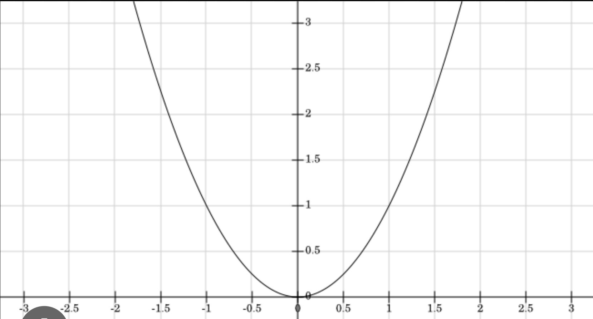

# Introduction to Functional Programming

- [Introduction to Functional Programming](#introduction-to-functional-programming)
  - [Information about lecturers](#information-about-lecturers)
  - [Welcome](#welcome)
  - [About this course](#about-this-course)
  - [Administrative information](#administrative-information)
    - [Lecture information](#lecture-information)
    - [Lecture timings](#lecture-timings)
    - [Materials](#materials)
    - [Asking questions](#asking-questions)
    - [Panopto](#panopto)
    - [Questions](#questions)
    - [Lecture notes format](#lecture-notes-format)
  - [Lecture 1: Functional programming Introduction 1](#lecture-1-functional-programming-introduction-1)
    - [Basic information as an intro](#basic-information-as-an-intro)
      - [Functional programming](#functional-programming)
        - [Statements vs expressions](#statements-vs-expressions)
        - [Haskell](#haskell)
      - [Extra material](#extra-material)
      - [Practicals](#practicals)
      - [Programming environment](#programming-environment)
      - [Programming the fibonacci sequence in haskell](#programming-the-fibonacci-sequence-in-haskell)
    - [Functional programming introduction](#functional-programming-introduction)
  - [Lecture 2: Functional programming Introduction 2](#lecture-2-functional-programming-introduction-2)
    - [Further structure of the square function](#further-structure-of-the-square-function)
    - [Further ways of defining functions](#further-ways-of-defining-functions)
      - [Lambda abstractions](#lambda-abstractions)
        - [Function examples](#function-examples)
      - [Values](#values)
      - [Methods of evaluation](#methods-of-evaluation)
        - [Examples](#examples)
      - [Methods of evaluating inputs before generating outputs](#methods-of-evaluating-inputs-before-generating-outputs)
        - [Pattern matching](#pattern-matching)
        - [Guards](#guards)
        - [Conditionals](#conditionals)
  - [Lecture 3: Functional programming Introduction 3](#lecture-3-functional-programming-introduction-3)
    - [A closer look at the factorial function from previous lecture](#a-closer-look-at-the-factorial-function-from-previous-lecture)
    - [Types](#types)
      - [What can be done with types](#what-can-be-done-with-types)
        - [Pattern matching (again)](#pattern-matching-again)
        - [Defining your own data types](#defining-your-own-data-types)

## Information about lecturers

- Led by Nick Wu, a reader in Computing

## Welcome

- Everyone is smart, so you'll be normal here
- Reflect on yourself and not with other people

## About this course

- The goal of this course is to teach you functional programming
  - This will give you a good basis of how to program
- Imperative programming will be introduced later on in the course

## Administrative information

- Timetable will provide you information on where to be adn when to be there

### Lecture information

- Lectures will be held:
  - From Monday: 11:00 am - 1:00 pm
  - From Tuesdays: 11:00 am - 1:00 pm
- Practical seminars will be held:
  - From Thursdays 9:00 am to 10:00 am
- Advanced Programming:
  - From Thursdays 5:00 pm to 6:00 pm

- Lectures are where the main bits of information are disseminated
- Practical seminars will cover the content from lectures in a practical standpoint
- Advanced programming provides some more information that provides more advanced content, but its completely optional and is not assessed
  
### Lecture timings

- Timings with lectures having breaks in between:
  - 1 hour lecture
    - 00:25 (3 minutes)
    - 00:50 (end)
  - 2 hour lecture
    - 00:25 (3 minutes)
    - 00:55 (5 minutes)
    - 01:25 (3 minutes)
    - 01:50 (end)

### Materials

- Scientia will contain:
  - Lecture notes
  - Tutorials and lab sheets
  - Unassessed exercises
    - Answers will be provided on Scientia with full solutions to check your answers

### Asking questions

- EdStem allows for you to ask questions to the cohort and to individuals who can answer your questions specifically
- You can answer questions yourself to practice by teaching other people

### Panopto

- Panopto will automatically upload all lectures to the website

### Questions

- Question sheets will allow for you to write down questions and pass to the lecturer
- These questions will be answered next lecture

### Lecture notes format

- Lecture notes will be written in a notepad
- The scans of lecture notes will be provided at the end of every week

## Lecture 1: Functional programming Introduction 1

### Basic information as an intro

#### Functional programming

- Functional programming is about programming with values rather than actions
  - This means that we tell a computer what something is rather than how to do it
  - This is very different from imperative programming

##### Statements vs expressions

- Statements are a thing that you're telling a computer to do, usually separated by a semi colon.
  - You don't need to understand what this does, but you're just telling the computer to do one thing after another
- Expressions are similar to mathematics like those in GCSEs and a levels
  - They are like formulas that will correspond to computation later on rather than a random sequence of actions

- Statements can be sequenced together to perform a task
- Expressions can be used to make code simpler to understand and more powerful
- Functional programming is about significantly expanding the kinds of things we can say with expressions

##### Haskell

- Haskell was originally a very academic language that is now being used increasingly more in real life
- The next generation of languages will be similar to Idris, Agda or Coq
- Haskell is like a language laboratory
  - Its like a petri dish for programming language features
- Many features have made their way from functional programming languages to imperative programming language worlds
- Statements are easier to write in haskell and are written in a nicer format for humans

#### Extra material

- Learn you a haskell
- Real world haskell
- Try Haskell

Better sources:

- Thinking functionality with haskell by Richard Bird - The book recommended by Nick Wu
- Programming in Haskell (2nd ed) by Graham Hutton
- The craft of functional programming by Simon Thompson

#### Practicals

- Practicals are there to explore the practical side of coding
- Try to be busy for the whole practical session
- Ask for help when you stuck but learn to ask good questions
  - Try and ask your questions to free rubber ducks to talk to and try and practice asking good questions

#### Programming environment

- The flow of programming:
  - Editor
    - To write your text for your code
    - VS Code is the best recommended
  - Compiler
    - To convert the text you have written into a format that can be read by machines
  - Terminal
    - Processed by a terminal in the computer
- Sometimes you can skip the compiling stage and you can work with an interpreter directly without dealing with the binary

#### Programming the fibonacci sequence in haskell

- The following is the function to write the fibonnaci function in haskell

```haskell
-- Fibonacci is shown here as a function "fib" who takes in an Int and outputs an Int
fib :: Int -> Int
--Define the base case, where fib 0 = 0 and fib 1 = 1
fib 0 = 0
fib 1 = 1
-- Implement the recursive step taking an input n and outputting the sum of fib of the previous 2 numbers
fib n = fib n-1 + fib n-2
```

- To execute the script, in the terminal prompt write:

```zsh
ghci FILENAME.hs
```

- It will output hte functions that exist within it
  - To check the type of the function, write:

```zsh
:t FUNCTION NAME # You can write fib here
```

### Functional programming introduction

- A function takes input from a domain and produces output in a codomain

- An example of a function is the $x^2$ function



- Let's define a function "f" that takes in a value from the x axis and outputs it in the y axis. This can also be done in Haskell:

```haskell
-- Why double? Double says its ok if there are decimals, this function will still work fine
square :: Double -> Double -- This is the signature. Tells you what the input and output type are.
square x = x * x -- This is the body
```

- A mental model for what the result is actually going to be when you execute this:
  - Haskell performs substitution.
    - When you say `square 3`: The function will go find the definition of square: `{def square}`
    - It then substitutes the x with the 3, the 3 is in the position of the x, hence it replaces the x with the 3
- Everything haskell returns will always be in the form of substitution as a mental model for us. What is actually done is far more complex and efficient though.

## Lecture 2: Functional programming Introduction 2

### Further structure of the square function

- Further structure of the square function

```haskell
square :: Double {-This is the domain-} -> Double {-This is the codomain-}
square x = x * x
```

### Further ways of defining functions

#### Lambda abstractions

- In mathematics you have probably defined many hundreds of "f's", as in $f(x)$
- However, why don't we just define functions by what they are?
  - A way of doing this is to use a $\lambda$, when we want to use a lambda expression instead of giving a function a name everytime we want to use one

- An example of doing this is as follows. The following is a code form of the lambda expression.

```haskell
square :: Double -> Double
square = \x -> x * x -- The \ is the λ
```

- The following is the mathematical form of the lambda expression

```haskell
square :: Double -> Double
square = λx . x * x
```

- Functional tip: If in any situation, you don't know how to create the lambda expression, you can "move" the x to before the "=" and write the left as the same and you would have the exact same function
- To use the lambda abstraction on a value, do the following

```haskell
-- This will use the function on the value 7
(\x -> x * x) 7
```

- The purpose of this is to create a function to talk about a function without needing to name it as "f" or as "g"
- The above has a square for the definition, but it is written solely as `\x -> x * x`
- If you do not name the function, it is absolutely for a throwaway purpose. It is never going to be used again and cannot be called again later.

##### Function examples

- Functions are applied to arguments which are then evaluated

- Here is another function

```haskell
two :: Int -> Int
two x = 2
```

- If this is manually evaluated:

```haskell
two 73

-- Call definition {def two}

 = 2
```

- This will always give you back 2

#### Values

- Here is a definition of a value:

```haskell
infinity :: Integer
infinity = infinity + 1
```

#### Methods of evaluation

- There are 2 main ways that a function can be evaluated:
  - Normal evaluation (Lazy evaluation)
    - This evaluates the outer most first before moving inwards
  - Applicative evaluation (Eager evaluation)
    - This evaluates the inner first before moving out

##### Examples

**Normal evaluation**

```haskell
square (two 5)
-- What is the outermost thing here? square!
-- Now call and apply definition of square {def square}
-- Here we would copy out the right hand side of whatever square of x is, replacing the x with the value
= two 5 * two 5
-- Now what is the outermost part here? It is actually multiplication. We have written it the infix operation with the multiplication in the middle. We could have written it as (*)(two 5)(two 5). We must now evaluate the outermost part which is *. However it requires both of its operands to be evaluated, hence we must evaluate the first two 5.
-- Call and apply definition of {def two}
-- Again copying out the right hand side:
= 2 * two 5
-- Call definition of two 5 again
= 2 * 2
-- Now call definition of multiplication {def *}
= 4
```

**Applicative (Eager) Evaluation**

```haskell
square (two 5)
-- The innermost part is actually 5. So we have to evaluate 5, but that has already been evaluated.
-- Hence we must now evaluate the two 5
-- Call definition of {def two}
= square (2)
-- The next innermost component is actually square
-- Call definition of {def square}
= 2 * 2
-- Call definition of {def *}
= 4
```

- We can notice here that eager evaluation may do less work, because the argument to square is evaluated just once.

However, consider the evaluation of:

Lazy evaluation:

```haskell
two infinity
-- {def two}
= 2
```

Eager evaluation:

```haskell
two infinity
-- {def Infinity}
= two (infinity + 1)
-- {def Infinity}
= two ((Infinity+1)+1)
=...
```

- Quick note: Had Infinity been defined as `1+Infinity`, you would have evaluated the 1, then moved to infinity
  - We would always move from left to right

#### Methods of evaluating inputs before generating outputs

- There are instances when you may want to check and take a look at what x actually is before you perform something to it.
- Often we need to inspect the input before we generate the output
- Pattern matching is the most efficient at runtime!

##### Pattern matching

Factorial function:

```haskell
factorial :: Integer -> Integer
factorial 0 = 0
factorial 1 = 1
factorial 2 = 2
factorial 3 = 6
-- ... you see where this goes?
factorial n = n * factorial (n-1) -- This is recursion!
```

- The above actually shows you two concepts, pattern matching and recursion!
- We only need to define the factorial of 0 here, the factorial of 1 is actually not necessary

**Beware of the following**

- The order is important, pattern matching is done from the top, moving down

##### Guards

- Sometimes we need a predicate to guard an equation, such as making sure the factorial function does not receive negative values as an input

Factorial function:

```haskell
factorial :: Integer -> Integer
factorial 0 = 1
factorial n
    | n < 0 = undefined
    | otherwise = n * factorial (n-1) -- otherwise is just "True" in haskell! If something is true, then you'd do the assigned task!
```

- The | is the structure of the guard

##### Conditionals

- A conditional is an if then else expression

```haskell
factorial :: Integer -> Integer
factorial n = if n == 0
                then 1
                else if n < 0 then undefined
                              else n * factorial (n-1)
```

**Beware of the following**

- Haskell is a whitespace sensitive language so make sure that it is correct in terms of indentation
- A rule for haskell, never use TABS only use space
- The compiler sees tabs as 8 spaces, but text files see them as 4! Hence be careful and avoid TABS
- Indentation can be of any length that you like, as long as you are consistent

## Lecture 3: Functional programming Introduction 3

### A closer look at the factorial function from previous lecture

```haskell
factorial 3
-- Call definition of {def factorial}
= 3 * factorial (3-1)
-- Perform lazy evaluation here, where the outermost thing is multiplication, thus checking if 3 is first evaluated
-- As 3 is already evaluated, we must now evaluate the factorial (3-1)
-- However in this case, the outermost thing is not done, as there is pattern matching within the function of factorial 0
-- Now factorial's definition to evaluate 3-1
-- The next thing to evaluate is the outermost thing of 3-1, which is minus
-- Now we check if 3 has been evaluated, which it is, then we evaluate 1, which is in its simplest form
-- Then you must now evaluate the minus to equal 2
= 3 * factorial 2
-- Call definition of {def factorial}
= 3 * (2 * factorial (2-1))
-- Now we try to evaluate the mulitplication, so we have to evaluate the right hand side as above
-- So now we must evaluate the factorial (2-1)
-- Evaluate 2-1 to perform pattern matching
= 3 * (2 * factorial (1))
-- Now we must evaluate factorial of 1. This process as you can see will keep repeating to reach:
...
= 3 * (2 * (1 * 1))
-- By following lazy evaluation we get:
= 6
```

### Types

- In Haskell, everything is immutable and cannot be changed once written
  - If you write x = 5, it will always be 5
- In Haskell, values are not uninitialised, they are always set to be what is on teh right hand side
- You can rewrite pretty much every pre built in data type except for numbers typically
- Every value has exactly 1 type
- A type is like a set in that it is a collection of values, however, in ths definition, a value cannot belong to many sets at once, a value can only belong to one type.

For example for Integer, we have:

```haskell
3 {-The 3 is called a value-}::Integer {- The "Integer" is called type-}
5::Integer
0::Integer
-27::Integer
```

- In Haskell there are different in built types. These are already defined for you. The following are those for numbers.
  - There are 2 types of Integers:
    - Integer
      - These are unbounded. Meaning they can be any size, larger than in python, C etc.
    - Int
      - Int has a range of $[-2^{29} ... 2^{29}-1]$
        - They are quite big. However if you reach the end at the value $2^{29}-1$ and add 1, Haskell will roll over and your value will become $-2^{29}$
  - Rational
    - These are unbounded and correspond to anything that is a fraction type will sit here
  - Float
    - Floats are single precision. They are approximate fractions and computers will fail at some point to evaluate them. Hence we have doubles.
    - The definitions are quite detailed, hence will not be covered in this lecture
  - Double
    - Doubles have double precision

- There are other such types in Haskell
  - Boolean
    - True and False values
    - `True :: Bool`
    - `False :: Bool`
  - Char
    - `'a' :: Char`
    - The single quotes must be present to distinguish the character from a variable.
  - String
    - `"Hello" :: String`
  - List
    - Lists are homogeneous, they must contain values of the same type only and is a restriction of lists
    - `[3, 4, 10] :: [Int]`
      - The `[Int]` means that this is a list of Integers
    - `[True, True, False] :: Bool`
    - `[[5], [3,7], [9,10], [3]] :: [[Int]]`
      - This is a list of list of Integers
    - `[]::[a]`
      - This is a bit weird. An empty list may be of only one type, an empty list of 'a's.
      - This is because the list does not actually know what the list of types this list is
      - This means that a list is of a polymorphic type, meaning it can be anything you want it to be
    - If a list contains tuples within which there are values, the items within the tuples will need to be of the same type
  - Tuples
    - Tuples can contain values of different types
    - `(5,3) :: (Integer, Integer)`
    - `(5, True) :: (Integer, Bool)`
    - `(5, 3, False):: (Integer, Integer, Bool)`
    - `((5,3), False) :: ((Integer, Integer), Bool)`
    - `(5, (3, False))::(Integer, (Integer, Bool))`
    - `()::()`
      - This may be a bit confusing, but the type of an empty tuple is an empty tuple
    - Tuples and lists can mix

**Beware of the following**

- If you ask what is the type of an Integer, you will be given the type of a number. This will be covered in later lectures. It will not return a type like Int or Integer

#### What can be done with types

##### Pattern matching (again)

We can have functions that can take in a bool and return Ints:

```haskell
silly :: Bool -> Int
silly False = 42
silly True = 73
```

- All of the types discussed above can be pattern matched as shown above

##### Defining your own data types

- You could have defined pretty much everything yourself in haskell (except for the basic numbers perhaps)
  - Many of the data types that we have seen could have been defined by the user themself

Here is an example:

```haskell
data Bool where
    True :: Bool
    False :: Bool
```

Another example:

```haskell
data Int where
    0 :: Int
    1 :: Int
    2 :: Int
    ... -- The ... is just here to explain, it can't actually be typed in haskell
```

- The above would take too long to write ourself, hence it is defined for us

Another example of such a thing that we could have defined ourself but is too long is:

```haskell
data Char where
    'a' :: Char
    'b' :: Char
    ... -- The ... is just here to explain, it can't actually be typed in haskell
```

- The above notation for defining data means the types are quite clear, but it is quite laborious. Instead we can just write:

```haskell
data Bool = False | True
data Char = 'a' | 'b' | 'c' | ... -- The ... is just here to explain, it can't actually be typed in haskell
```

- You can also define data types with other things

```haskell
data Day = Monday | Tuesday | ... -- The ... is just here to explain, it can't actually be typed in haskell
```

- Here is a new function that uses our data

```haskell
day :: Day -> Int
day Monday = 1
day Tuesday = 2
... -- The ... is just here to explain, it can't actually be typed in haskell
```