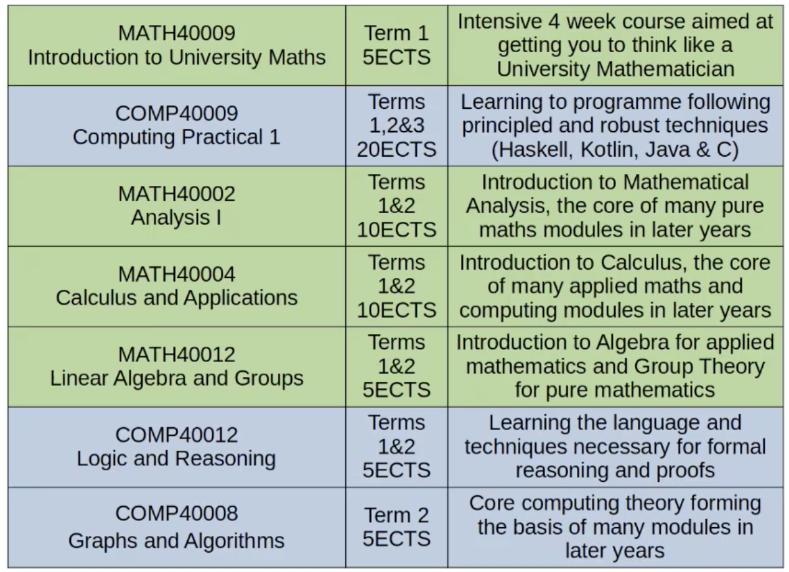

# Introduction to JMC year 1

- [Introduction to JMC year 1](#introduction-to-jmc-year-1)
  - [JMC - Degree Overview](#jmc---degree-overview)
    - [Year 1 - levelling the playing field](#year-1---levelling-the-playing-field)
    - [Year 2 - big systems and specialising](#year-2---big-systems-and-specialising)
    - [Year 3 - breadth of knowledge and experience](#year-3---breadth-of-knowledge-and-experience)
    - [Year 4 - depth of knowledge and experience](#year-4---depth-of-knowledge-and-experience)
  - [JMC Year 1 - All modules](#jmc-year-1---all-modules)
  - [JMC - Year 1 Support Structure](#jmc---year-1-support-structure)
    - [PPT (Personalised Programming Tutorials)](#ppt-personalised-programming-tutorials)
    - [PMT (Personalised Mathematics Tutorials)](#pmt-personalised-mathematics-tutorials)
    - [JMC Maths Catch-up Tutorials](#jmc-maths-catch-up-tutorials)
    - [PT (Personal Tutor)](#pt-personal-tutor)
    - [ST (Senior Tutor)](#st-senior-tutor)
    - [Programme Directors (Mark Wheelhouse and David Ham)](#programme-directors-mark-wheelhouse-and-david-ham)
  - [Miscellaneous information](#miscellaneous-information)

## JMC - Degree Overview

### Year 1 - levelling the playing field

providing you with the programming, computing and mathematical
foundations needed for the course in later years.

### Year 2 - big systems and specialising

learning the principles of engineering large systems, such as operating
systems and compilers, and choosing your mathematical specialism(s).

### Year 3 - breadth of knowledge and experience

the BEng year gives you lots of choice about what you learn, with the
modules in this year getting you to the cutting edge of professional/industry level practices

### Year 4 - depth of knowledge and experience

the MEng year also has lots of choice about what you learn, with the
modules in this year getting you to the cutting edge of research

## JMC Year 1 - All modules

Although the computing modules may seem smaller in number, they are actually quite large modules that last all 3 terms. The degree must be evenly split between the 2 departments for year 1 and 2. You can skew it once you enter year 3 and 4.

## JMC - Year 1 Support Structure

### PPT (Personalised Programming Tutorials)

supporting the programming content of COMP40009 Computing Practical 1. Undergraduate teaching assistants will be helping students and teaching them how to program. Part of the computing side of support.

### PMT (Personalised Mathematics Tutorials)

Supporting the theory content of COMP40012 Logic and Reasoning and COMP40008 Graphs and Algorithms. Part of the computing side of support. Will not begin until introduction to university maths is over. About week 6-7. To support logic and reasoning and graphs and algorithms. With an undergaduate assistant that is supervised by an academic.

### JMC Maths Catch-up Tutorials

supporting the mathematical content of all Year 1 Maths modules

### PT (Personal Tutor)

first point of contact for your pastoral care needs (support for settling into Uni life, module options, CV reference and sign-post for other services). Will help you with your CV when applying for jobs by writing reference letters etc or when doing internships etc. First point of contact.

### ST (Senior Tutor)

the Department's pastoral care lead, able to provide extensive support/advice

### Programme Directors (Mark Wheelhouse and David Ham)

in charge of the academic structure of the degree programme

## Miscellaneous information

In computing, you will have regular problem sheets which will be submitted and marked. In maths you may also have problem sheets that will get submitted and marked but most of them will not. You can go to problem classes and ask about the old stuff, you do not need to worry that you are not up to the current week's content. The PPTs do not actually count for credit. It is marked and you also get feedback on all of it, but do not worry if you don't get every single test case to pass as it is better to receive feedback on the one test case that doesn't work.

5 or 6 hours per module is how much time you should be spending doing maths and computer science. Half of this is in lectures and the other half is doing the work outside. In total about 40 hours should be spent on maths and computer science.

Everything other than intro to uni maths and computing practical has exams in the summer term. The intro to uni maths and computing practical have exams as the module goes along.