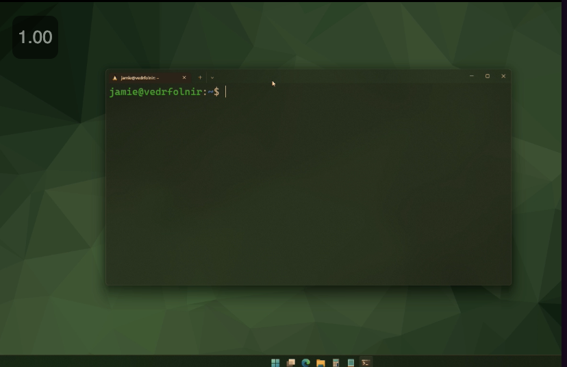

# Introduction to Programming Utilities

- [Introduction to Programming Utilities](#introduction-to-programming-utilities)
  - [Introduction to Programming Utilities (A)](#introduction-to-programming-utilities-a)
    - [What is the purpose of this lecture?](#what-is-the-purpose-of-this-lecture)
    - [What is linux](#what-is-linux)
    - [Using Linux](#using-linux)
      - [Terminal Basics](#terminal-basics)
        - [Important directories](#important-directories)
        - [Important commands](#important-commands)
        - [SSH, SCP, SFTP Usage](#ssh-scp-sftp-usage)
          - [SSH to enter a university lab machine](#ssh-to-enter-a-university-lab-machine)
          - [SCP to transfer a file a university lab machine](#scp-to-transfer-a-file-a-university-lab-machine)
          - [SFTP to transfer a file a university lab machine](#sftp-to-transfer-a-file-a-university-lab-machine)
          - [Create a key to avoid entering a password everytime you SSH](#create-a-key-to-avoid-entering-a-password-everytime-you-ssh)
        - [Miscellanious Commands](#miscellanious-commands)
  - [Introduction to Programming Utilities (B)](#introduction-to-programming-utilities-b)
    - [What is the purpose of this lecture?](#what-is-the-purpose-of-this-lecture-1)
    - [Text editors](#text-editors)
      - [Gedit](#gedit)
      - [Nano](#nano)
      - [VSCode](#vscode)
    - [Haskell installation](#haskell-installation)
      - [Installation process](#installation-process)
      - [Running haskell scripts](#running-haskell-scripts)

## Introduction to Programming Utilities (A)

### What is the purpose of this lecture?

- To teach you what you need to know to use the departmental systems and set up your own stuff
- This first lecture will talk about linux and commands to use for various things



- The above image shows a full linux kernel running in windows
  - This is the windows sbsystem for linux. Running a full linux kernel.

### What is linux

- Linux is a family of operating systems, called distributions
  - Department computers use Ubuntu
  - Following demonstrations will be of linux running inside WSL (Windows Subsystem for Linux) using Ubuntu

### Using Linux

- To install WSL on windows, go to command line and install WSL
- When installed, it will automatically download the packages necessary
- On uni lab machines, you cannot install anything. *ATTEMPTING TO RUN `sudo` on a lab machine will send an email to everyone in CSG with you and your email.*
- Do not try and link to the windows files within WSL

#### Terminal Basics

- When you want to install a package, just try to install it with a name. If the name cannot be found, google it to find the name and install it then.
    - - The `.bashrc` file contains the config for the terminal file.

##### Important directories

- The tilda "~" tells you about the home directory.
  - This is similar to C/: on Windows
  - The actual path is /home/USERNAME
- `.` is our current directory
- `..` is to move up one directory
- `.sh` files are files that mean shell scripts.

##### Important commands

- `cd` is to change directory
- `ls` is to list the directories within your current directory
  - the `-la` option provides more information. Such as permissions.
    - Within the output for ths option, the d means if it is a directory or not. The r is whether you can read it. The w is whether you can write to it. The x means if it is executable or not.
    - The values after the first 4 letters is for other users
    - The `.la` option reveals hidden files too. These are files with a `.` in front of them.
- `touch` is a command that can create a file into existance. If it already exists, nothing will happen.
- `pwd` tells you your current directory
- `mkdir` makes a directory of the given name
- `echo` is like a print statement for the terminal
- `>` will pipe content into a file. It will replace everything in the file.
- `>>` will add something to a file without replacing it
- `cat` will print everything inside a file
- `cp` is to copy. The initial file is the file to copy from and the second file is the file to copy to. cp makes a duplicate a file.
- `mv` will move a file and delete the original. The initial file is the file to move from and the second file is the file to move to.
  - It can also be used to rename something.
- `rm` is to remove a file. `rm` can't delete directories.
  - The `-r` option will delete a directory recursively.
  - If a directory is protected, use `-f` to force delete it. Be careful when using it.
- `apt` is a package manager for Ubuntu. `apt` cannot be run without `sudo`.
  - `apt` is short for aptitude, is a package manager.
  - The `update` command under `apt` will fetch information on all the packages that can be updated.
  - The `upgrade` command under `apt` is the command that actually upgrades all packages that can be upgraded.
  - You should update before you upgrade.
- `./` is used to run a `.sh` file
- `chmod` can be used to add permissions to a file
  - `+x` option can be used to update the file to make it executable

##### SSH, SCP, SFTP Usage

- The first S is used to mean that the protocol is secure
- SSH stands for Secure Shell - Used to open a terminal session on another machine
  - This is used to link all the other commands together. This is what links them under the hood.
- SCP is used to copy files from another machine
- SFTP is to open a more interactive interface to access content from another machine
- When inside Imperial, you are within a firewall, so you can just give the name of a lab machine to access it
- When outside, you will need to use a shell machine to access a lab machine
  - Do not run anything on a shell machine
- Your files are shared across all the machines in imperial.
- Imperial machines provide a few gigs of storage. Around 10 Gigs.
- In order to avoid a password everytime you SSH into a computer, you need to make an SSH key

###### SSH to enter a university lab machine

- To access a shell machine:

```bash
ssh anb122@shell1.doc.ic.ac.uk
```

- Accept the machine and that you trust it
- Then enter your imperial password
- Then select a lab machine to jump to from here:
  
```bash
# You will need to remember the name of a lab machine to SSH into it.
ssh willow03 #willow03 is an example
```

- To check who else is on the same machine as you, type `w`.
  - The more people on a machine, it may be slightly slower
- To exit, just type `exit`

###### SCP to transfer a file a university lab machine

- To get a file from the university machine to your machine:

```bash
# When you type `.`, the file comes to your computer at your current directory
scp anb122@shell1.doc.ic.ac.uk:FILEYOUWANT .
```

###### SFTP to transfer a file a university lab machine

- To engage in an SFTP session, write:

```bash
$$sftp anb122@shell1.doc.ic.ac.uk
```

- To run commands locally, place an `l` in front of it
  - For example, run `lls` to list files locally
- You can use `get` and `put` to move files around. `get` will move files to your system, `put` will move to them. They are copy commands that do not delete the original. If you move a file to either directory that has the same name, it will be overwritten.
- There are a limited selection of commands in SFTP to do things

###### Create a key to avoid entering a password everytime you SSH

- Run the following:

```bash
ssh-keygen
```

- Allow for the file to be saved under id_rsa or whatever default is given
- When running the above command, you will be able to avoid the password when you ssh from wherever you ran the command above
- The above command creates 2 files, `id_rsa` and `id_rsa.pub`
- Then copy your public key into the imperial machine

```bash
ssh-copy-id anb122@shell1.doc.ic.ac.uk
```

- The above tries to ssh in and tries to copy your public key into the authorised keys file
- This will then now say that the key has been moved in and you can now ssh in without a password
- This can be moved into your GitLab to clone repos without needing to enter your password

##### Miscellanious Commands

```bash
# This will reset the terminal to re-read the config file
source .bashrc
```

## Introduction to Programming Utilities (B)

### What is the purpose of this lecture?

- Installing haskell
- Discuss the built in text editor in linux

### Text editors

#### Gedit

- G stands for GNU and edit for edit
- Whatever edits you use, use spaces as mixing hard tabs and spaces will look weird

#### Nano

- Nano is a terminal based text editor
- Will be introduced at the end of the year and can be used when you use things such as git merges or on the lab machines when you need to use a text editor that isn't GUI based

#### VSCode

- VSCode is the recommended text editor for coding
- VSCode has remote extensions, that allows for you to work in vscode on lab machines
  - Remote WSL and Remote SSH
    - Remote SSH - Work in your vscode window but on another machine
    - Remote WSL - To work within a WSL but within a normal windows environment
    - Installed via extensions called `WSL`
    - ED Stem post will contain information on remote SSH for your usage

### Haskell installation

- GHCup is the best way of installing haskell. Installing via sudo apt get is very outdated.
- GHCup is a script that needs to be run without administrative rights that will install various parts of the haskell toolchain and the ability to configure any of them
- If you run GHCup on a lab machine yourself, it will be a local installation that only affects you. Ask hte lecturer to do it for you and it will avoid changing the amount of disk space you have.

#### Installation process

- To find the version of linux you have, type `lsb_release -a`. Use this information to find the version of haskell you should install.
- Do not run the script to install with elevated privileges as it will be installed in root
  - On mac, do not run with `sudo`
- When you run the following script, ensure to add it to your path, so that you don't need to search for the program everytime you would like to use it. Select `A` to add it to the end.

```bash
curl --proto '=https' --tlsv1.2 -sSf https://get-ghcup.haskell.org | sh
```

- Select no when asked to install HLS, as you want to install an up to date one yourself later.
- You will not use stack probably. Stack and Cabal are two build systems for Haskell and we will be using Cabal.
- Cabal is a package manager for haskell and it will fetch the package list from Haskell when installing via GHCup.
- Stack is newer and has slightly nicer build configuration and it is built on top of Cabal and hasn't really added much new.

```bash
# The following command will list what has been installed
ghcup list
```

- Following this, install the Haskell Language Server to be able to connect haskell to code compilers and add code completion.

```bash
# Find the version you want to install for hls after running `ghcup list` and write the corresponding version number instead of VERSIONNUMBER
ghcup install hls VERSIONNUMBER
```

#### Running haskell scripts

- The following covers ways of running a script without Cabal
- Run the following to run a script

```bash
ghci FILENAME.hs
```

- ghci stands for ghc interpreter
- To update the interpretation of a script when it has already been run, run `:r`
- To quit ghci, type `:q`
- To run a file as is, without opening the interpreter, run:

```bash
runghc FILENAME.hs
```

- runghc will compile and then run the file
- If you want to compile teh haskell file, run the following:

```bash
ghc FILENAME.hs -o OUTPUTEXECUTABLENAME
```

- The output executable can now be run without the need to compile
- To add comments that will appear upon hovering over a function, add the following above that function:

```haskell
{- |
This function squares :)
-}
```
- For single line comments:

```haskell
-- | Here goes my comment :)
```

