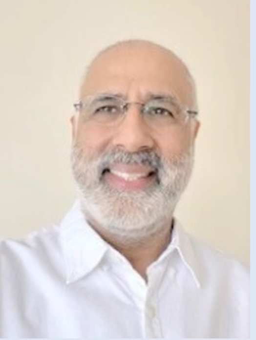

# Welcome to the First Year - Department of Computing

- [Welcome to the First Year - Department of Computing](#welcome-to-the-first-year---department-of-computing)
  - [Staff of DoC](#staff-of-doc)
    - [Head of Department - Professor Michael Huth](#head-of-department---professor-michael-huth)
    - [Deputy Head of Department - Dr Naranker Dulay](#deputy-head-of-department---dr-naranker-dulay)
    - [Director of UnderGraduate Studies - Professor Paul Kelly](#director-of-undergraduate-studies---professor-paul-kelly)
    - [First Year Coordinator - Dr Konstantinos Gkoutzis](#first-year-coordinator---dr-konstantinos-gkoutzis)
    - [Director of JMC - Dr Mark Wheelhouse](#director-of-jmc---dr-mark-wheelhouse)
    - [Student Administration Officers - Ms Annis Etheridge \& Mr Ciprian Ciobanu](#student-administration-officers---ms-annis-etheridge--mr-ciprian-ciobanu)
    - [Computing librarian - Ms Ann Brew](#computing-librarian---ms-ann-brew)
    - [Deputy Senior Tutor \& Departmental Disability Officer - Dr Thomas Lancaster](#deputy-senior-tutor--departmental-disability-officer---dr-thomas-lancaster)
    - [Student Wellbeing Advisor - Ms Caroline Gilchrist](#student-wellbeing-advisor---ms-caroline-gilchrist)
    - [Senior Tutor - Dr Maria Valera-Espina](#senior-tutor---dr-maria-valera-espina)
  - [Student Departmental Reps](#student-departmental-reps)
  - [DoCSoc](#docsoc)
  - [Computer Support Group (CSG)](#computer-support-group-csg)
  - [ICT support](#ict-support)
  - [Career Support - Mr Richard Carruthers](#career-support---mr-richard-carruthers)
  - [Five tips for a happy life at Imperial College London](#five-tips-for-a-happy-life-at-imperial-college-london)
    - [Don't chase every mark](#dont-chase-every-mark)
    - [Take time to socialise](#take-time-to-socialise)
    - [When you get tired/stuck, STOP](#when-you-get-tiredstuck-stop)
    - [Book time off in advance to do other things, e.g](#book-time-off-in-advance-to-do-other-things-eg)
    - [Be kind, tolerant, and supportive](#be-kind-tolerant-and-supportive)
  - [Your voice](#your-voice)
  - [What makes the Imperial DoC different?](#what-makes-the-imperial-doc-different)
  - [First Year Introudction sessions](#first-year-introudction-sessions)
  - [Miscellanious Notes](#miscellanious-notes)

## Staff of DoC

### Head of Department - Professor Michael Huth

[Link to website.](www.doc.ic.ac.uk/~mrh)

### Deputy Head of Department - Dr Naranker Dulay

[Link to website.](www.doc.ic.ac.uk/~nd)

### Director of UnderGraduate Studies - Professor Paul Kelly

[Link to website.](www.doc.ic.ac.uk/~phjk)

Director of all undergraduate teaching program.

### First Year Coordinator - Dr Konstantinos Gkoutzis

[Link to website.](www.doc.ic.ac.uk/~kgk)

Room - Huxley 306

[Email](mailto:kgk@ic.ac.uk)

### Director of JMC - Dr Mark Wheelhouse

[Link to website.](www.doc.ic.ac.uk/~mjw03)

### Student Administration Officers - Ms Annis Etheridge & Mr Ciprian Ciobanu

[Annis email](mailto:a.etheridge@imperial.ac.uk)

[Ciprian email](mailto:constantin-ciprian.ciobanu@imperial.ac.uk)

Room - Huxley 370. Open from 9 to 5 but closed from 1-2 for lunch.

### Computing librarian - Ms Ann Brew

[Email](mailto:ann.brew@imperial.ac.uk)
[Link to website.](www.imperial.ac.uk/people/ann.brew)

Will be met on Wed 11/10 (next week), 09:00-10:00 at the Introduction to the Libary session.

### Deputy Senior Tutor & Departmental Disability Officer - Dr Thomas Lancaster

[Email](mailto:tlancast@imperial.ac.uk)

[Link to website](www.imperial.ac.uk/disability-advisory-service)

Speak to them if you feel if you have an undiagnosed learning disability

### Student Wellbeing Advisor - Ms Caroline Gilchrist

[Email](mailto:c.gilchrist@imperial.ac.uk)

### Senior Tutor - Dr Maria Valera-Espina

[Email](mailto:doc-senior-tutor@imperial.ac.uk)

## Student Departmental Reps

**Computing:**

Nishant Jalan (Academic)

Teo Hughes (Wellbeing)

**JMC:**

Ines Wright (Academic)

Chris Lee (Wellbeing)

## DoCSoc

President: Pratyaksh Sharma

Vice President: Jacob Bailey

**Links to social media:**
<https://DoCSoc.co.uk>

twitter.com/ICDoCSoc

fb.com/ICDoCSoc

## Computer Support Group (CSG)

[Email](mailto:doc-help@imperial.ac.uk)

[Link to website.](www.imperial.ac.uk/computing/csg)

Room - Huxley 305

## ICT support

[Link to website.](https://servicemgt.imperial.ac.uk/ask)

## Career Support - Mr Richard Carruthers

[Link to careers site](www.imperial.ac.uk/careers)

Located on Sherfield Building - 5th Floor

## Five tips for a happy life at Imperial College London

### Don't chase every mark

Study (& love) the things you like most and let the marks look after
themselves
Remember that 60% is a good mark!

### Take time to socialise

Have dinner every evening with your friends

### When you get tired/stuck, STOP

• Go to bed, take a break, ….
If/when you get back to work you'll solve your problems in a fraction
of the time

### Book time off in advance to do other things, e.g

• Society activities
• Eating out
• Theatre, cinema, gigs, opera, …
• Visit London [Visit London Website](https://www.visitlondon.com/)

### Be kind, tolerant, and supportive

You are part of an ecosystem, so work with each other to make the
whole more than the sum of the parts

## Your voice

• As partners, you have an important say in what/how we teach and
how the Department and College operates
• If you have ideas, comments, suggestions...
• Respond to requests for input
• Come to open meetings
• Contribute to your EdStem year group forum
• Talk to your reps
• Talk to me, the TFs, your Personal Tutor, ...
• When voicing your ideas/opinions please remember that you are
part of the community, e.g.
• I don't expect they will ever do this, but... X
• Why don't we... v

## What makes the Imperial DoC different?

Imperial is a research university. A research university is one which believes that teaching and research should happen in the same place. It may not always seem that way, but you may need to look for the added value that comes from being in a research university. This will be evident in the 3rd and 4th year when you get to pick modules and take part in projects.

## First Year Introudction sessions

Taking place on 05/10 15:00-16:00 (Huxley 308)

Most questions you may have will be answered on the [DoC website](www.imperial.ac.uk/computing).

## Miscellanious Notes

For particularly large lectures, you may be double booked on your calendar. One will be an overflow room and the other will be another room with an actual human teaching you.

PPT and PMT are only for year one. Your personal tutor will be with you for all 3-4 years of your study.

There are competitive programming competitions each year. First one in end of October and second one at end of November. There is also one at the end of next year. 
