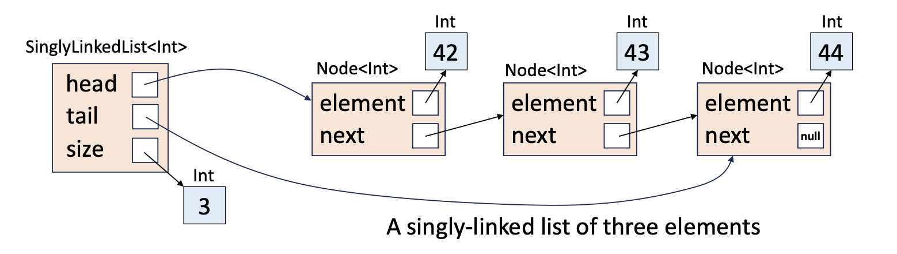
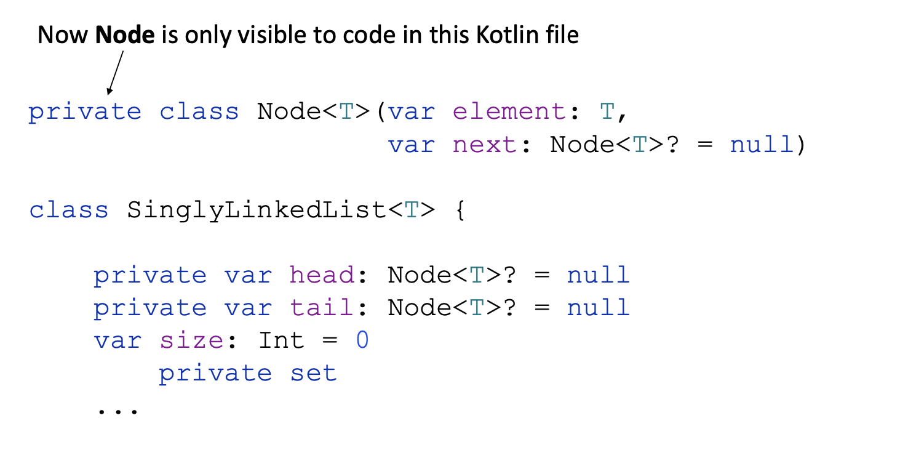
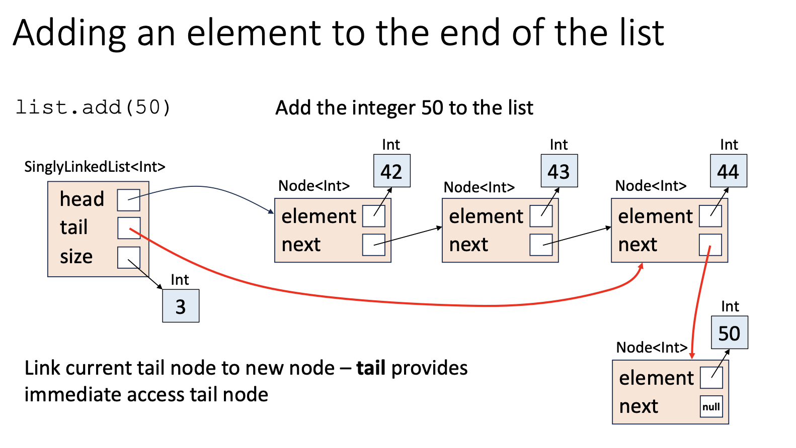
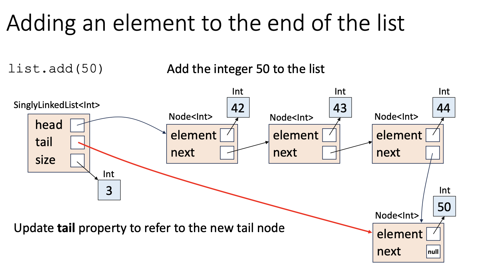
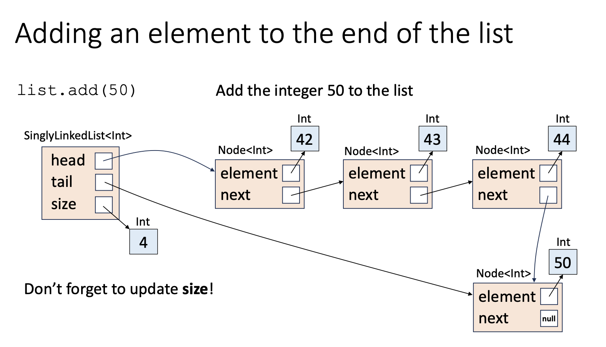
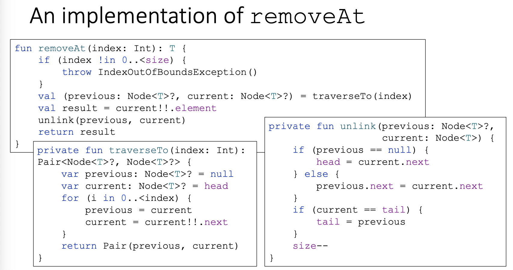

# Lecture 2: Linked lists in Kotlin 04-12-2023

- [Lecture 2: Linked lists in Kotlin 04-12-2023](#lecture-2-linked-lists-in-kotlin-04-12-2023)
  - [Building linked lists using the node class](#building-linked-lists-using-the-node-class)
  - [The list class](#the-list-class)
    - [Building the list class](#building-the-list-class)
    - [Manipulating the list](#manipulating-the-list)
      - [Adding an item](#adding-an-item)
      - [The idea](#the-idea)
      - [The implementation](#the-implementation)
      - [Removing an item at a specific index](#removing-an-item-at-a-specific-index)
      - [The idea](#the-idea-1)
      - [The implementation](#the-implementation-1)
  - [Interfaces](#interfaces)
    - [Encapsulation](#encapsulation)
    - [Ad Hoc polymorphism, or overloading](#ad-hoc-polymorphism-or-overloading)

## Building linked lists using the node class

- We can write the node class as follows for a linked list which contains a element and a next:

```kotlin
class Node<T>(var element: T, var next: Node<T>? = null)
```

- Here, the `?` next to the `Node<T>?` represents the fact that the next is nullable
- We also have that the `= null` is a default value

## The list class

- The list class comprises of:
  - The head of the list - A reference to a list node
  - The tail of the list - A reference to a list node
    - This is useful as it allows us to find the last node very quickly
  - The size of a list - a reference to an integer
    - We have this and we could instead just traverse the list to find the size, but we choose to store this as the list may be very large and it may take long to compute the length of the list

- This diagram helps explain this idea



### Building the list class

```kotlin
class Node<T>(var element: T, var next: Node<T>? = null)
class SinglyLinkedList<T>() {
  private var head: Node<T>? = null
  private var tail: Node<T>? = null
  var size: Int = 0
  private set
```

- Here we don't want to let people to just create instances of the node class, hence we introduce it to only the SinglyLinkedList

> Generally, it is good to try and hide the internal details of your class

- Now we can try and make Node private



- However we may have that some other file may have a name clash, with two files in teh same package but with a class Node declared in both
  - Say we were establishing a Node for a BST in one file and a Linked List file with a node, giving us an error where it is being redeclared

- Hence what we can do, is we can make Node a nested class
  - > Note, this is not an inner class, as this is different from a nested class
  - Hence its name would become SinglyLinkedList.Node

```kotlin
class SinglyLinkedList<t> {
  private class Node<T> (var element: T,
  var next: Node<T>? = null)

  private var head: Node<T>? = null
  private var tail: Node<T>? = null
  var size: Int = 0
  private set
```

- Now, these two may be declared in the same package under different files and hence can live in harmony


### Manipulating the list

#### Adding an item

#### The idea

- Here, to add an element to a list
  - We create a new node with the element that we want to add
  - We then traverse to the end of the list and set hte next of the tail to be the new node
  - Then we set the tail of the list to be the new node that we've added
  - Then we increment the size of the list

- Step 1:



- Step 2:



- Step 3:



#### The implementation


- Here's a code implementation:

```kotlin
fun add(element: T) {
  size++
  val newNode = Node(element)
  if (head == null) {
    head = newNode
    tail = newNode
    return
  }
  tail!!.next = newNode
  tail = newNode
}
```

- We first increment size on the code
- THen we create a new node, where the next on this node is null by default

#### Removing an item at a specific index

#### The idea

- We first check if the index is actually in the list
- We follow links from the head to find the ntde we'd like to remove and track its predecessor while moving through
- We then unlink the target node and update the predecessor to be the successors following node
- We reduce the size of the list by 1

#### The implementation



## Interfaces

### Encapsulation

- If class A uses class B, we say that A is a client of B
  - We also say that B provides a service to A
- When designing a class, consider the service the class is intended to provide to its clients
  - The services are provided via public properties and methods of the class
  - All other things and internal details should be made private

>Try to ensure that you use the language's collecetions over your own whenever possible

### Ad Hoc polymorphism, or overloading

- We can overload

> Content covering implementing an interface was shown today 